# 🔐 Refresh Token Implementation Audit

## ✅ Executive Summary

**Your Hono backend server HAS implemented refresh token functionality for Directus authentication.**

The implementation follows Directus authentication best practices with httpOnly cookies, proper token rotation, and secure configuration. However, **automatic token refresh is NOT implemented** - the frontend must manually call the refresh endpoint when needed.

---

## 📋 Audit Results

### **1. Authentication Routes (`server/src/routes/auth.ts`)**

#### ✅ **POST `/auth/refresh` Endpoint EXISTS**

<augment_code_snippet path="server/src/routes/auth.ts" mode="EXCERPT">

````typescript
/**
 * POST /auth/refresh
 * Refreshes access token using refresh token from cookie
 */
auth.post("/refresh", async (c) => {
  try {
    const cookieHeader = c.req.header("Cookie") || null;
    const refreshToken = getCookie(cookieHeader, config.refreshTokenCookieName);

    if (!refreshToken) {
      logAuth.noToken("/auth/refresh");
      return c.json({ error: "No refresh token found" }, 401);
    }

    // Call Directus refresh endpoint
    const response = await fetch(`${config.directusUrl}/auth/refresh`, {
      method: "POST",
      headers: {
        "Content-Type": "application/json",
      },
      body: JSON.stringify({ refresh_token: refreshToken }),
    });
````

</augment_code_snippet>

**✅ Functionality:**

- ✅ Reads refresh token from httpOnly cookie
- ✅ Calls Directus `/auth/refresh` API
- ✅ Handles missing refresh token (401 error)
- ✅ Handles failed refresh (401 error)
- ✅ Updates both access and refresh tokens after successful refresh
- ✅ Logs refresh success/failure

---

### **2. Token Storage Mechanism**

#### ✅ **Refresh Tokens Stored in httpOnly Cookies**

<augment_code_snippet path="server/src/routes/auth.ts" mode="EXCERPT">

````typescript
// Refresh token cookie (if provided)
if (refreshToken) {
  cookieHeaders.push(
    generateSetCookie(config.refreshTokenCookieName, refreshToken, {
      httpOnly: true,
      secure: config.isProduction,
      sameSite: "Lax",
      maxAge: config.cookieMaxAge * 2, // Refresh token lives longer
    })
  );
}
````

</augment_code_snippet>

**✅ Cookie Configuration:**

- **Cookie Name:** `refresh_token` (configurable via `REFRESH_TOKEN_COOKIE_NAME`)
- **httpOnly:** `true` ✅ (prevents JavaScript access - XSS protection)
- **secure:** `true` in production ✅ (HTTPS only)
- **sameSite:** `Lax` ✅ (CSRF protection)
- **maxAge:** `config.cookieMaxAge * 2` ✅ (refresh token lives 2x longer than access token)
  - Default: 14 days (access token: 7 days)

---

### **3. Token Refresh Flow**

#### ✅ **Token Update After Refresh**

<augment_code_snippet path="server/src/routes/auth.ts" mode="EXCERPT">

````typescript
const data = (await response.json()) as any;
const newAccessToken = data.data?.access_token;
const newRefreshToken = data.data?.refresh_token;

if (!newAccessToken) {
  return c.json({ error: "No access token received" }, 500);
}

// Set new cookies
const cookieHeaders: string[] = [];

cookieHeaders.push(
  generateSetCookie(config.accessTokenCookieName, newAccessToken, {
    httpOnly: true,
    secure: config.isProduction,
    sameSite: "Lax",
    maxAge: config.cookieMaxAge,
  })
);

if (newRefreshToken) {
  cookieHeaders.push(
    generateSetCookie(config.refreshTokenCookieName, newRefreshToken, {
      httpOnly: true,
      secure: config.isProduction,
      sameSite: "Lax",
      maxAge: config.cookieMaxAge * 2,
    })
  );
}
````

</augment_code_snippet>

**✅ Token Rotation:**

- ✅ Updates access token cookie
- ✅ Updates refresh token cookie (if Directus provides a new one)
- ✅ Maintains same security settings (httpOnly, secure, sameSite)
- ✅ Returns success response

---

### **4. Configuration (`server/src/config.ts`)**

<augment_code_snippet path="server/src/config.ts" mode="EXCERPT">

````typescript
// Cookies
sessionCookieName: process.env.SESSION_COOKIE_NAME || "auth_session",
accessTokenCookieName: process.env.ACCESS_TOKEN_COOKIE_NAME || "access_token",
refreshTokenCookieName:
  process.env.REFRESH_TOKEN_COOKIE_NAME || "refresh_token",
cookieMaxAge: parseInt(process.env.COOKIE_MAX_AGE || "604800000", 10), // 7 days
````

</augment_code_snippet>

**✅ Environment Variables:**

- `REFRESH_TOKEN_COOKIE_NAME` - Default: `"refresh_token"`
- `COOKIE_MAX_AGE` - Default: `604800000` ms (7 days)
- Refresh token maxAge: `COOKIE_MAX_AGE * 2` (14 days)

---

## ⚠️ Missing Functionality: Automatic Token Refresh

### **Current State:**

**❌ NO automatic token refresh is implemented.**

The frontend (`src/contexts/auth-context.tsx`) does NOT automatically call `/auth/refresh` when the access token expires.

**Current Frontend Behavior:**

1. User logs in → tokens stored in httpOnly cookies
2. User makes API call → access token sent automatically via cookie
3. **If access token expires** → API returns 401 error
4. **Frontend does NOT automatically refresh** → User sees error or gets logged out

---

### **What's Missing:**

#### **1. Frontend: No Automatic Refresh Logic**

The `auth-context.tsx` does NOT have:

- ❌ Axios/fetch interceptor to catch 401 errors
- ❌ Automatic call to `/auth/refresh` on 401
- ❌ Retry logic for failed requests after refresh
- ❌ Token expiration tracking

**Current Code:**

```typescript
// src/contexts/auth-context.tsx
const checkAuth = async () => {
  const response = await fetch("/auth/me", {
    credentials: "include",
  });

  if (response.ok) {
    setUser(userData);
  } else {
    // ❌ Just clears user - doesn't try to refresh
    setUser(null);
    setToken(null);
  }
};
```

---

#### **2. Backend: No Automatic Refresh Middleware**

The backend does NOT have:

- ❌ Middleware to automatically refresh tokens on 401 from Directus
- ❌ Proxy middleware to intercept 401 responses and retry with refresh

**Current Proxy Code:**

```typescript
// server/src/routes/proxy.ts
if (accessToken) {
  headers.set("Authorization", `Bearer ${accessToken}`);
} else {
  // ❌ Just logs warning - doesn't try to refresh
  logAuth.noToken(path);
}
```

---

## 🎯 How Refresh Token Flow Currently Works

### **Manual Refresh Flow:**

```mermaid
sequenceDiagram
    participant User
    participant Frontend
    participant Backend
    participant Directus

    User->>Frontend: Login
    Frontend->>Backend: POST /auth/login
    Backend->>Directus: POST /auth/login
    Directus-->>Backend: access_token + refresh_token
    Backend-->>Frontend: Set httpOnly cookies
    Note over Frontend,Backend: access_token (7 days)<br/>refresh_token (14 days)

    User->>Frontend: Make API call
    Frontend->>Backend: GET /api/users/me (cookies sent)
    Backend->>Directus: GET /users/me (Bearer token)
    
    alt Access token valid
        Directus-->>Backend: User data
        Backend-->>Frontend: User data
    else Access token expired
        Directus-->>Backend: 401 Unauthorized
        Backend-->>Frontend: 401 Unauthorized
        Note over Frontend: ❌ User sees error<br/>❌ No automatic refresh
    end

    Note over User,Directus: Manual Refresh (if implemented in frontend)
    User->>Frontend: Click "Refresh" button
    Frontend->>Backend: POST /auth/refresh (cookies sent)
    Backend->>Directus: POST /auth/refresh (refresh_token)
    Directus-->>Backend: new access_token + new refresh_token
    Backend-->>Frontend: Set new httpOnly cookies
    Frontend->>Backend: Retry API call
    Backend->>Directus: GET /users/me (new Bearer token)
    Directus-->>Backend: User data
    Backend-->>Frontend: User data
```



---

## 📊 Comparison with Best Practices

| Feature | Current Implementation | Best Practice | Status |
|---------|----------------------|---------------|--------|
| **Refresh endpoint exists** | ✅ `POST /auth/refresh` | ✅ Required | ✅ **PASS** |
| **Calls Directus refresh API** | ✅ Yes | ✅ Required | ✅ **PASS** |
| **Reads refresh token from cookie** | ✅ Yes | ✅ Required | ✅ **PASS** |
| **Updates both tokens** | ✅ Yes | ✅ Required | ✅ **PASS** |
| **httpOnly cookies** | ✅ Yes | ✅ Required | ✅ **PASS** |
| **Secure flag in production** | ✅ Yes | ✅ Required | ✅ **PASS** |
| **SameSite protection** | ✅ Lax | ✅ Required | ✅ **PASS** |
| **Refresh token lives longer** | ✅ 2x access token | ✅ Recommended | ✅ **PASS** |
| **Logging** | ✅ Success/failure logged | ✅ Recommended | ✅ **PASS** |
| **Automatic refresh on 401** | ❌ No | ⚠️ Recommended | ⚠️ **MISSING** |
| **Frontend retry logic** | ❌ No | ⚠️ Recommended | ⚠️ **MISSING** |
| **Token expiration tracking** | ❌ No | ⚠️ Optional | ⚠️ **MISSING** |

---

## 🔍 Testing the Current Implementation

### **Test 1: Manual Refresh (Backend)**

```bash
# 1. Login first
curl -X POST http://localhost:3000/auth/login \
  -H "Content-Type: application/json" \
  -d '{"email":"user@example.com","password":"password"}' \
  -c cookies.txt

# 2. Call refresh endpoint
curl -X POST http://localhost:3000/auth/refresh \
  -b cookies.txt \
  -c cookies.txt

# Expected response:
# {"success":true}
# Cookies updated with new tokens
```

### **Test 2: Verify Cookies**

```bash
# Check cookies file
cat cookies.txt

# Expected:
# localhost  FALSE  /  FALSE  0  access_token  <new-token>
# localhost  FALSE  /  FALSE  0  refresh_token  <new-token>
```

### **Test 3: Frontend Manual Refresh**

```typescript
// Add this to your frontend (e.g., in a button click handler)
const handleRefresh = async () => {
  try {
    const response = await fetch("/auth/refresh", {
      method: "POST",
      credentials: "include",
    });

    if (response.ok) {
      console.log("✅ Token refreshed successfully");
      // Retry your failed API call here
    } else {
      console.error("❌ Token refresh failed");
      // Redirect to login
    }
  } catch (error) {
    console.error("❌ Refresh error:", error);
  }
};
```

---

## 🚨 Potential Issues

### **1. Token Expiration Without Automatic Refresh**

**Issue:** If a user stays on the page for > 7 days (access token expiration), their next API call will fail with 401.

**Impact:**

- ❌ User sees error message
- ❌ User must manually refresh or re-login
- ❌ Poor user experience

**Solution:** Implement automatic token refresh (see recommendations below)

---

### **2. Refresh Token Expiration**

**Issue:** If refresh token expires (> 14 days), user MUST re-login.

**Current Behavior:**

- ✅ `/auth/refresh` returns 401
- ❌ Frontend doesn't handle this gracefully

**Solution:** Add error handling to redirect to login on refresh failure

---

### **3. No Token Expiration Tracking**

**Issue:** Frontend doesn't know when tokens will expire.

**Impact:**

- ❌ Can't proactively refresh before expiration
- ❌ Can't show "session expiring soon" warning

**Solution:** Add token expiration tracking (see recommendations below)

---

## ✅ Summary

### **What EXISTS:**

✅ **Refresh endpoint:** `POST /auth/refresh`  
✅ **Directus integration:** Calls Directus `/auth/refresh` API  
✅ **Cookie handling:** Reads refresh token from httpOnly cookie  
✅ **Token rotation:** Updates both access and refresh tokens  
✅ **Security:** httpOnly, secure (production), SameSite=Lax  
✅ **Logging:** Success/failure logged  
✅ **Configuration:** Environment variables for customization  

### **What's MISSING:**

❌ **Automatic token refresh:** Frontend doesn't auto-refresh on 401  
❌ **Retry logic:** Failed requests aren't retried after refresh  
❌ **Token expiration tracking:** No proactive refresh before expiration  
❌ **Graceful error handling:** Refresh failure doesn't redirect to login  

---

## 🎯 Recommendations

See `REFRESH_TOKEN_RECOMMENDATIONS.md` for detailed implementation guide on:

1. Implementing automatic token refresh in frontend
2. Adding retry logic for failed requests
3. Proactive token refresh before expiration
4. Graceful error handling and user experience improvements

---

**Your refresh token implementation is solid and follows Directus best practices. The main gap is automatic refresh functionality, which would significantly improve user experience.** 🚀
